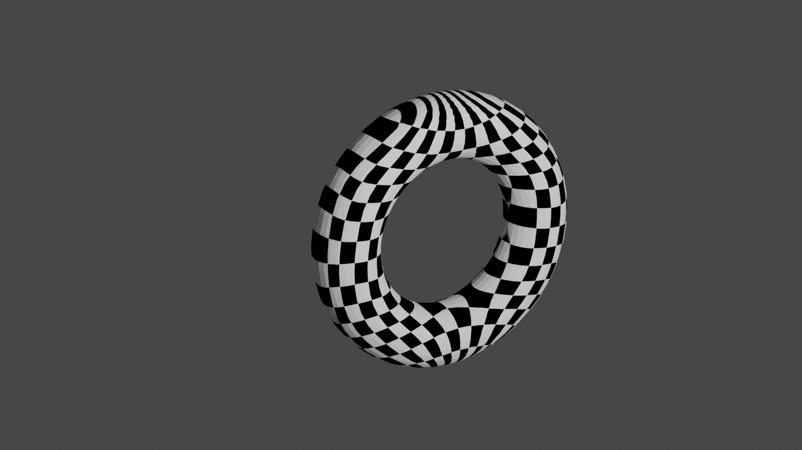
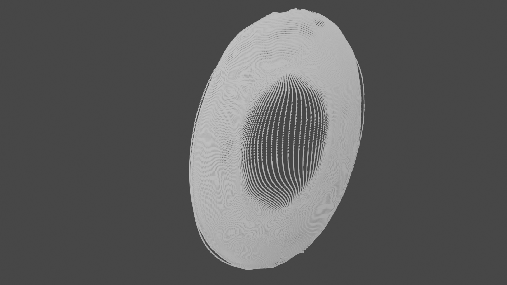
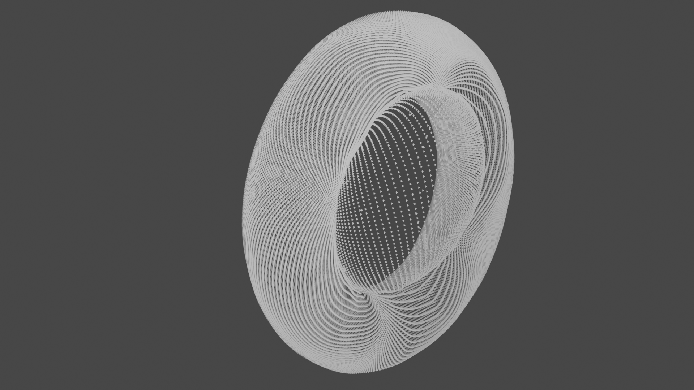
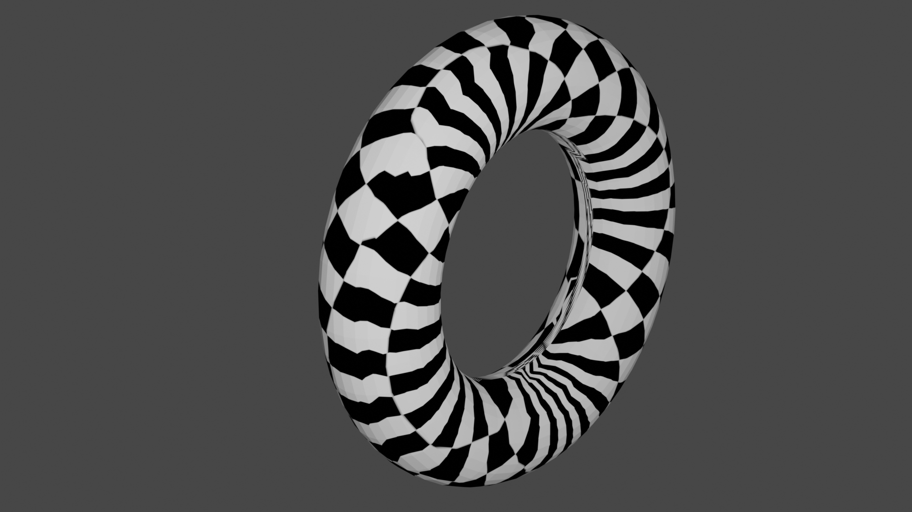
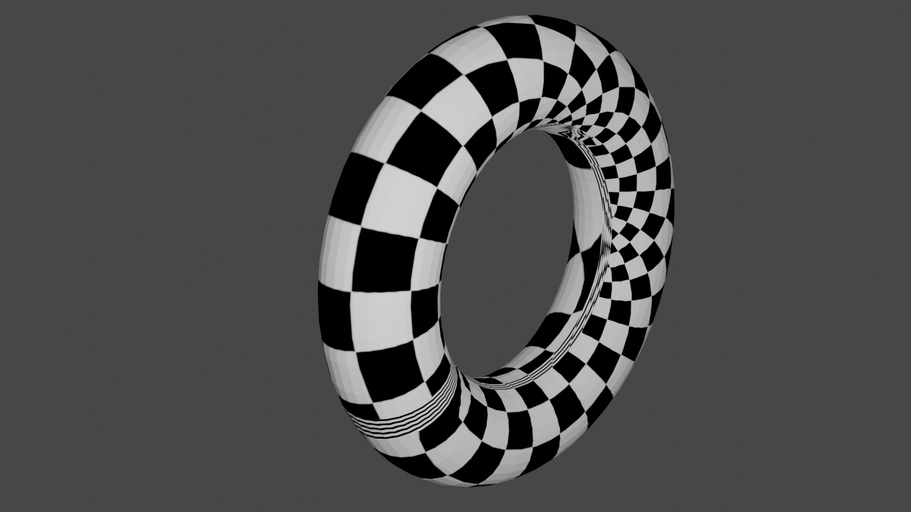

# vae-textures

This is an experiment with using variational autoencoders (VAEs) to perform [mesh parameterization](https://en.wikipedia.org/wiki/Mesh_parameterization). This was also my first project using [JAX](https://github.com/google/jax) and [Flax](https://github.com/google/flax), and I found them both quite intuitive and easy to use.

To get straight to the results, check out the [Results](#results) section. The [Background](#background) section describes the goals of this project in a bit more detail.

<p align="center">
    
</p>

# Background

In geometry processing, mesh parameterization allows high-resolution details of a 3D object, such as color and material variations, to be stored in a highly-optimized 2D image format. The strategy is to map each vertex of the 3D model's mesh to a unique 2D location in the plane, with the constraint that nearby points in 3D are also nearby in 2D. In general, we want this mapping to distort the geometry of the surface as little as possible, so for example large features on the 3D surface get a lot of pixels in the 2D image.

This might sound familiar to those familiar with machine learning. In ML, mapping a higher-dimensional space to a lower-dimensional space is called "embedding" and is often performed to aid in visualization or to remove extraneous information. VAEs are one technique in ML for mapping a high-dimensional space to a well-behaved latent space, and have the desirable property that probability densities are (approximately) preserved between the two spaces.

Given the above observations, here is how we can use VAEs for mesh parameterization:

 1. For a given 3D model, create a "surface dataset" with random points on the surface and their respective normals.
 2. Train a VAE to generate points on the surface using a 2D Gaussian latent space.
 3. Use the gaussian CDF to convert the above latents to the uniform distribution, so that "probability preservation" becomes "area preservation".
 4. Apply the 3D -> 2D mapping from the VAE encoder + gaussian CDF to map the vertices of the original mesh to the unit square.
 5. Render the resulting model with some test 2D texture image acting as the unit square.

The above process sounds pretty solid, but there are some quirks to getting it to work. Coming into this project, I predicted two possible reasons it would fail. It turns out that number 2 isn't that big of an issue (an extra orthogonality loss helps a lot), and there was a third issue I didn't think of (described in the [Results](#results) section).

 1. Some triangles will be messed up because of cuts/seams. In particular, the VAE will have to "cut up" the surface to place it into the latent space, and we won't know exactly where these cuts are when mapping texture coordinates to triangle vertices. As a result, a few triangles must have points which are very far away in latent space.
 2. It will be difficult to force the mapping to be conformal. The VAE objective will mostly attempt to preserve areas (i.e. density), and ideally we care about conformality as well.

# Results

This was my first time using JAX. Nevertheless, I was able to get interesting results right out of the gate. I ran most of my experiments on a torus 3D model, but I have since verified that it works for more complex models as well.

Initially, I trained VAEs with a Gaussian decoder loss. I also played around with an orthogonality bonus based on the eigenvalues of the Jacobian of the encoder. This resulted in texture mappings like this one:


The above picture looks like a clean mapping, but it isn't actually bijective. To see why, let's sample from this VAE. If everything works as expected, we should get points on the surface of the torus. For this "sampling", I'll use the mean prediction from the decoder (even though its output is a Gaussian distribution) since we really just want a deterministic mapping:



It might be hard to tell from a single rendering, but this is just a flat disk with a low-density hole in the middle. In particular, the VAE isn't encoding the z axis at all, but rather just the x and y axes. The resulting texture map looks smooth, but every point in the texture is reused on each side of the torus, so the mapping is not bijective.

I discovered that this caused by the Gaussian likelihood loss on the decoder. It is possible for the model to reduce this loss arbitrarily by shrinking the standard deviations of the x and y axes, so there is little incentive to actually capture every axis accurately.

To achieve better results, we can drop the Gaussian likelihood loss and instead use pure MSE for the decoder. This isn't very well-principled, and we now have to select a reasonable coefficient for the KL term of the VAE to balance the reconstruction accuracy with the quality of the latent distribution. I found good hyperparameters for the torus, but these will likely require tuning for other models.

With the better reconstruction loss function, sampling the VAE gives the expected point cloud:



The mappings we get don't necessarily seem angle-preserving, though:



To preserve angles, we can add an orthogonality bonus to the loss. When we try to make the map preserve angles, we might make it less area preserving, as can be seen here:



Also note from the last two images that there are seams along which the texture looks totally messed up. This is because the surface cannot be flattened to a plane without some cuts, along which the VAE encoder has to "jump" from one point on the 2D plane to another. This was one of my predicted shortcomings of the method.

# Running

First, install the package with 

```
pip install -e .
```

## Training

My initial VAE experiments were run like so, via `scripts/train_vae.py`:

```shell
python scripts/train_vae.py --ortho-coeff 0.002 --num-iters 20000 models/torus.stl
```

This will save a model checkpoint to `vae.pkl` after 20000 iterations, which only takes a minute or two on a laptop CPU.

The above will train a VAE with Gaussian reconstruction loss, which may not learn a good bijective map (as shown above). To instead use the MSE decoder loss, try:

```shell
python scripts/train_vae.py --recon-loss-fn mse --kl-coeff 0.001 --batch-size 1024 --num-iters 20000 models/torus.stl
```

I also found a better orthogonality loss function. To get reasonable mappings that attempt to preserve angles, add `--ortho-coeff 0.01 --ortho-loss-fn rel`.

## Using the VAE

Once you have trained a VAE, you can export a 3D model with the resulting texture mapping like so:

```shell
python scripts/map_vae.py models/torus.stl outputs/mapped_output.obj
```

Note that the resulting `.obj` file references a `material.mtl` file which should be in the same directory. I already include such a file with a checkerboard texture in [outputs/material.mtl](outputs/material.mtl).

You can also sample a point cloud from the VAE using `point_cloud_gen.py`:

```shell
python scripts/point_cloud_gen.py outputs/point_cloud.obj
```

Finally, you can produce a texture image such that the pixel at point `(x, y)` is an RGB-encoded, normalized `(x, y, z)` coordinate from `decoder(x, y)`.

```shell
python scripts/inv_map_vae.py models/torus.stl outputs/rgb_texture.png
```
