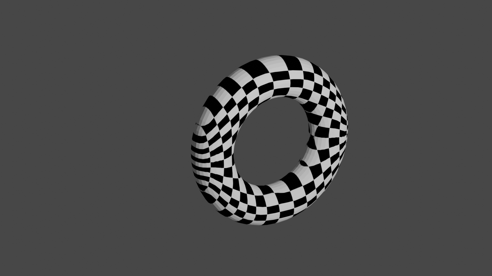

# vae-textures

This is an experiment with using variational autoencoders (VAEs) to perform [mesh parameterization](https://en.wikipedia.org/wiki/Mesh_parameterization).



# The plan

 * For a given 3D model, create a "surface dataset" with random points on the surface and their respective normals.
 * Train a VAE to generate points on the surface using a 2D Gaussian latent space. Possibly add a conformality term to the loss to encourage orthogonal directions on the surface to be orthogonal in (uniform) latent space.
 * Use the gaussian CDF to convert the above latents to the uniform distribution.
 * Apply the 3D -> 2D mapping from above to map the vertices of the original mesh to the unit square, and render the resulting model with some test 2D texture image.

Some immediately obvious limitations:

 * Some triangles will be messed up because of cuts/seams. In particular, the VAE will have to "cut up" the surface to place it into the latent space, and we won't know exactly where these cuts are when mapping texture coordinates to triangle vertices. As a result, some triangles will be messed up because one of their vertices likely has two far-away places in latent space where it could belong.
 * It will be difficult to force the mapping to be conformal. The VAE objective will mostly attempt to preserve areas (i.e. density), and ideally we care about conformality as well.

# Results

This was my first time using JAX. Nevertheless, I was able to get interesting results right out of the gate.

Here is a torus with no orthogonality bonus, with the :


Here is a torus with a bonus for orthogonality (coefficient 0.001).


# Running

First, install the package with 

```
pip install -e .
```

To train a VAE, run `scripts/train_vae.py` like so:

```shell
python scripts/train_vae.py --ortho-loss 0.001 --num-iters 20000 models/torus.stl
```

In the above command, the `--ortho-loss` flag controls the coefficient of the orthogonality bonus. This will save a model checkpoint to `vae.pkl` after 20000 iterations, which only takes a minute or two on a laptop CPU. Now you can export a 3D model with the resulting texture mapping like so:

```shell
python scripts/map_vae.py models/torus.stl outputs/torus_ortho.obj
```

Note that the resulting `.obj` file references a `material.mtl` file which should be in the same directory. I already include such a file with a checkerboard texture in [outputs/material.mtl](outputs/material.mtl).
